# TDzHTMLText

Extended version of the [DzHTMLText](https://github.com/digao-dalpiaz/DzHTMLText) by [Rodrigo Depiné Dalpiaz](https://github.com/digao-dalpiaz)

[Original README](README_ORIGINAL.md)

---


* [New tags](#new-tags)
  * [&lt;HR&gt; - Horizontal line](#hr---horizontal-line)
  * [&lt;H1&gt;, &lt;H2&gt;, &lt;H3&gt; - Headers](#h1-h2-h3---headers)
  * [&lt;LI&gt;, &lt;LI2&gt; - List items (1st and 2nd level)](#li-li2---list-items-1st-and-2nd-level)
  * [&lt;LC&gt; - Line color](#lc---line-color)
  * [&lt;BBC&gt; - Body background color](#bbc---body-background-color)
  * [&lt;SUB&gt; - Subscript](#sub---subscript)
  * [&lt;SUP&gt; - Superscript](#sup---superscript)
  * [&lt;IMG&gt; - Images](#img---images)
* [Additional changes](#additional-changes)
	* [Lazarus support](#lazarus-support)
	* [Support for additional colors notations](#support-for-additional-colors-notations)
	* [HTML Entites](#html-entites)
  * [ExtraLineSpacing](#extralinespacing)
  * [ExtraWordSpacing](#extrawordspacing)
  * [Internal margins](#internal-margins)
  * [Border](#border)
  * [Vertical alignment](#vertical-alignment)
  * [Loading and saving](#loading-and-saving)
* [TODO](#todo)

---


# My modifications

## New tags
* &lt;HR&gt; - Horizontal line
* &lt;H1&gt; - Header 1
* &lt;H2&gt; - Header 2
* &lt;H3&gt; - Header 3
* &lt;LI&gt; - List item - 1st level
* &lt;LI2&gt; - List item - 2nd level
* &lt;LC&gt; - Background line color drawn from the current position to the end of the current line
* &lt;BBC&gt; - Body background color drawn from the beginning of the current line to the end of the document
* &lt;SUB&gt; - Subscript
* &lt;SUP&gt; - Superscript
* &lt;IMG&gt; - Image

---

## &lt;HR&gt; - Horizontal line

Horizontal line drawn in the color selected for the text with the **FC** tag.  
The **HR** tag accepts one optional numeric parameter that specifies the length of the line in pixels. If this parameter is negative, the line will be cut at the end by the given number of pixels.

In the **Object Inspector** (`TagHRParams` property) you can set two additional parameters:
```delphi
LineHeight: integer;
Style: TPenStyle;
```

#### Example 1
The line drawn in the current color from the left to right edge of the component:
```html
<HR>
```
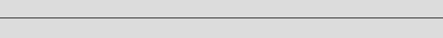


#### Example 2
The line drawn from the position of 70 pixels to the right edge:
```html
<T:70><HR>
```
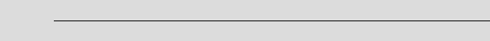


#### Example 3
The line truncated from the left and the right by 120 pixels:
```html
<T:120><HR:-120>
```


#### Example 4
A red line cut off by 256 pixels on the right:
```html
<FC:clRed><HR:-256></FC>
OR
<FC:#FF0000><HR:-256></FC>
OR
<FC:rgb(255,0,0)><HR:-256></FC>
```
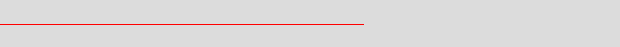

---

## &lt;H1&gt;, &lt;H2&gt;, &lt;H3&gt; - Headers

All header parameters can be set in the **Object Inspector**. Properties: `TagH1Params`, `TagH2Params` and `TagH3Params`.  
For each header, you can set the following properties:
```delphi
Alignment: TAlignment; // center, left or right
BackgroundColor: TColor;
Font: TFont;
Transparent: Boolean; // default True
```

#### Example

```html
<H1>Header 1</H1>
<H2>Header 2</H2>
<H3>Header 3</H3>
```
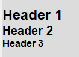

---

## &lt;LI&gt;, &lt;LI2&gt; - List items (1st and 2nd level)

List parameters can be set in the **Object Inspector** using properties: `TagLIParams` and `TagLI2Params`. You can set here:
```delphi
BulletType: TDHBulletType;
CustomString: string;
Margin: integer;
Spacing: Byte;
```

Bullet types:

|Type|Char|
|:---|:---|
|btBullet|•|
|btCircle|&SmallCircle;|
|btDash|-|
|btLongDash|&ndash;|
|btCustomString| string specified in the<br>`CustomString` field|

`Margin` - margin from the left edge of the control to the first character of the text.  
`Spacing` - space (in pixels) from the bullet char to the text.

The **LI** and **LI2** tags accept one parameter - a string used as the list bullet. If specified, the value set in the **Object Inspector** in the `BulletType` property will be ignored.

#### Example
```html
<li>List item 1
<li>List item 2
<li>List item 3
<li:4.>List item 4 (forced bullet "4.")
<li:5.>List item 5 (forced bullet "5.")
<li2>Subitem 1
<li2>Subitem 2
<li2:*>Subitem 3 (forced bullet "*")
```
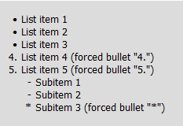

---

## &lt;LC&gt; - Line color

Background line color drawn from the current position to the end of the current line.

#### Example
```html
ABCD <LC:##87CEEB> 1234
```
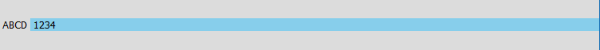

---

## &lt;BBC&gt; - Body background color

Body background color drawn from the beginning of the current line to the end of the document.
You can use several **BBC** tags to draw rectangles in the document.

#### Example
```html
<bbc:clGray>
<c><fc:rgb(255,255,255)>Gray background</fc></c>

<bbc:#EEE8AA>
<c>Yellow - PaleGoldenrod</c>

<bbc:#CD853F>
<c><fc:clWhite>Brown - Peru</fc></c>

<bbc:#4682B4>
<c><fc:clWhite>SteelBlue</fc></c>
```


---

## &lt;SUB&gt; - Subscript

The text in the the **SUB** tag is displayed in a slightly smaller font and below the normal text. The size and position are calculated automatically, but you can change these automatically calculated values using `TagSUBParams.FontSizeDelta` and `TagSUBParams.PosYDelta`.

#### Example
```html
<c><fs:11>Tourmaline - general formula</fs>
<fs:14><fn:Verdana>XY<sub>3</sub>Z<sub>6</sub>[(OH)<sub>4</sub>(BO<sub>3</sub>)<sub>3</sub>(Si<sub>6</sub>O<sub>18</sub>)]</fn></fs></c>
```
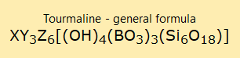

---

## &lt;SUP&gt; - Superscript

The text in the the **SUB** tag is displayed in a slightly smaller font and above the normal text. The size and position are calculated automatically, but you can change these automatically calculated values using `TagSUPParams.FontSizeDelta` and `TagSUPParams.PosYDelta`.

#### Example
```html
<c><fs:16>a<sup>2</sup> + b<sup>2</sup> = c<sup>2</sup></fs></c>
```
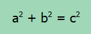

---

## &lt;IMG&gt; - Images

The IMG tag accepts one parameter, which may be the file name or PNG image index from the image collection associated with the component.

#### Example
```html
<fs:12>
<bbc:#DB8A8A>
<c>My beautiful logo


</c>
</fs>
```
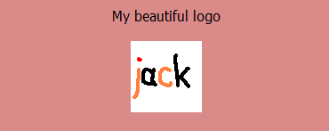

If you want to use the PNG collection, drop the **TDzPngCollection** from the **Component Palette** on the form and associate your `DzHTMLText` component with this collection using property `DzHTMLText.PngCollection`. **TDzPngCollection** is a non-visual component which can store any number of PNG images. Unlike **TImageList**, each image can have a different size. Images are stored internally as PNG, not bitmaps, which reduces the size of the DFM file. Of course, assuming that PNG images are compressed.

Add some images to `DzPngCollection` using the `Items` property in the **Object Inspector**. You can also add images at runtime using methods: `AddPngImage`, `AddPngImageFromFile`.

To display image from the collection you can use, eg:
```html

```
where `0` is the index of the PNG image in the `DzPngCollection` component.


<br><br><br>

## Additional changes

### Lazarus support

Tested on Lazarus 2.0.3 and FPC 3.3.1, on Windows 10 (32 &amp; 64-bit) and Xubuntu 18.04 (32 &amp; 64-bit).

---

### Support for additional colors notations

In addition to the original component, which uses the Delphi color names (`clWhite`, `clRed`...) and hexadecimal BGR notation with the `$00` prefix, you can also use HTML/CSS colors, eg.:

* `<lc:#FFAA88>`
* `<fc:#00FF00>`
* `<bc:#ABC>` - short notation for `#AABBCC`

and RGB colors, eg::
* `<bbc:Rgb(50,100,150)>`
* `<fc:RGB(255,128,128)>`
* `<fc:rgb(128 64 32)>` - spaces can also be separators
* `<fc:rgb(200)>` - short notation for `rgb(200,200,200)`

---

### HTML Entites

I changed the name of the `ReplaceForcedChars` function to `ReplaceHtmlEntities` and added support for the additional HTML entities. The original component only supported `&lt;` (&lt;) and `&gt;` (&gt;) entites.

**A full list of supported HTML entities**

|HTML Entity|Symbol|
|:---|:--:|
|`&lt;`|&lt;|
|`&gt;`|&gt;|
|`&euro;`| &euro;|
|`&cent;`|&cent;|
|`&pound;`|&pound;|
|`&yen;`|&yen;|
|`&amp;`|&amp;|
|`&copy;`|&copy;|
|`&reg;`|&reg;|
|`&sect;`|&sect;|
|`&deg;`|&deg;|
|`&sup2;`|&sup2;|
|`&sup3;`|&sup3;|
|`&Integral;`|&Integral;|
|`&micro;`|&micro;|
|`&para;`|&para;|
|`&middot;`|&middot;|
|`&plusmn;`|&plusmn;|  
|`&times;`|&times;|  
|`&divide;`|&divide;|
|`&plusmn;`|&plusmn;|
|`&times;`|&times;|
|`&divide;`|&divide;|
|`&Omega;`|&Omega;|
|`&alpha;`|&alpha;|
|`&beta;`|&beta;|
|`&gamma;`|&gamma;|
|`&Gamma;`|&Gamma;|
|`&delta;`|&delta;|
|`&Delta;`|&Delta;|
|`&pi;`|&pi;|
|`&Pi;`|&Pi;|
|`&Sigma;`|&Sigma;|
|`&bull;`|&bull;|
|`&ndash;`|&ndash;|
|`&trade;`|&trade;|
|`&SmallCircle;`|&SmallCircle;|

#### Example
```html
<bbc:#555><fc:#DDD>
<fs:14><fn:Courier New>
&Delta; = b&sup2; &ndash; 4ac
E = mc&sup2;
P<sub>o</sub> = &Pi;r&sup2;
sin&sup2;&alpha; + cos&sup2;&alpha; = 1
</fn></fs></fc>
```
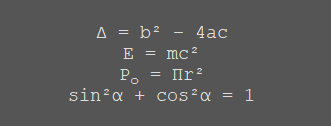

---

### ExtraLineSpacing

Additional vertical space between lines in pixels. Property `TDzHTMLText.ExtraLineSpacing`.

Default line spacing:
```html
<t:20>ExtraLineSpacing = 0
<t:20>ExtraLineSpacing = 0
<t:20>ExtraLineSpacing = 0
<t:20>ExtraLineSpacing = 0
```
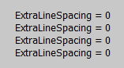
<br><br>
ExtraLineSpacing = 6:
```html
<t:20>ExtraLineSpacing = 6
<t:20>ExtraLineSpacing = 6
<t:20>ExtraLineSpacing = 6
<t:20>ExtraLineSpacing = 6
```
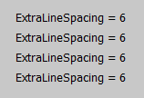

---

### ExtraWordSpacing

Additional horizontal space between words in pixels. Property `TDzHTMLText.ExtraWordSpacing`.

```html
<t:20>The default spacing between words
<t:20>The default spacing between words
<t:20>The default spacing between words
<t:20>The default spacing between words
```
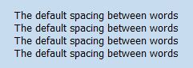

<br>

```html
<t:20>Extra word spacing = 4
<t:20>Extra word spacing = 4
<t:20>Extra word spacing = 4
<t:20>Extra word spacing = 4
```
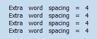

---

### Internal margins

#### Example

```html
<bbc:$00E6C8DC>

Some text
Some text
<t:10>Some text (10)
<t:20>Some text (20)
```

<br>

```delphi
DzHTMLText.Color := $00A06596;
DzHTMLText.InternalMargins.Left := 20;
DzHTMLText.InternalMargins.Right := 20;
```

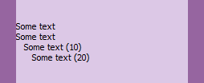

<br>

```delphi
DzHTMLText.Color := $00E6C8DC;
DzHTMLText.InternalMargins.Left := 20;
DzHTMLText.InternalMargins.Right := 20;
```
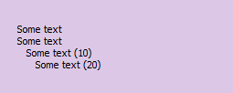

---

### Border

You can set the component's boder using `TDzHTMLText.Border` property.

Warnig! Flickering when border width > 1. Place **DzHTMLText** on **TPanel**/**TForm** with `DoubleBuffered` set to True.

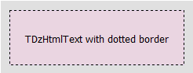

---

### Vertical alignment

The displayed text can be positioned vertically, but only when the `AutoHeight` is set to False.

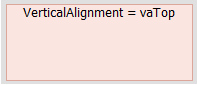
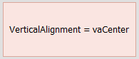
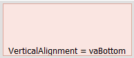

---

### Loading and saving

You can save and load text with the `SaveToFile` and `LoadFromFile` methods.

To save the displayed text (which is actually an image) to the bitmap, use `SaveToBitmap` or `SaveToBitmapFile` methods.


## TODO

* `Text: string` --> `Lines: TStrings`.
* Implement `BeginUpdate`, `EndUpdate`.
* Padding.
* TCustomDzHTMLText
* Fix bugs!